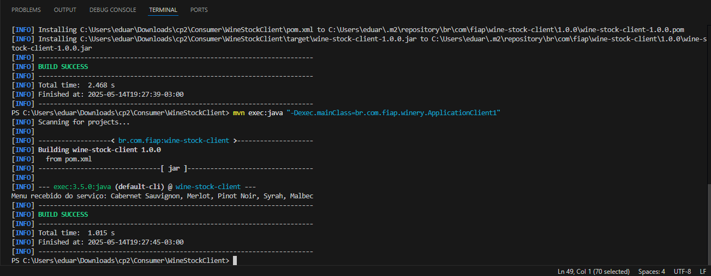

# Checkpoint 2 - Web Service SOAP - FIAP

Este repositório contém a implementação completa do trabalho de Checkpoint 2 da FIAP, utilizando Web Services no padrão **SOAP** com **Java 17** e **Maven**.

## 🗂 Estrutura do Projeto

```
API-SOAP/
├── Publisher/
│   └── WinerySys/           # Projeto que expõe os serviços SOAP
├── Consumer/
│   ├── WineStockClient/     # Cliente que consome o método getMenu()
│   └── WineOrderClient/     # Cliente que consome placeOrder() e sendWarn()
```

---

## 🚀 Como Executar (Mantenha todos terminais abertos)


### ✅ 1. Subir os serviços (Publisher)

Abra um terminal e execute:

```bash
cd Publisher/WinerySys
mvn clean install
mvn exec:java
```

Você verá:
```
Serviço de estoque publicado!
Serviço de aviso publicado!
```

Verifique no navegador:
- http://localhost:8085/WineStockService?wsdl
- http://localhost:8086/WineWarningService?wsdl

---

### ✅ 2. Rodar o cliente WineStockClient

Em outro terminal:

```bash
cd Consumer/WineStockClient
mvn clean install
mvn exec:java "-Dexec.mainClass=br.com.fiap.winery.ApplicationClient1"
```

✅ Este cliente consome o método `getMenu()`.

---

### ✅ 3. Rodar o cliente WineOrderClient

```bash
cd Consumer/WineOrderClient
mvn clean install
mvn exec:java "-Dexec.mainClass=br.com.fiap.winery.ApplicationClient2"
```

Você verá:
```
Retorno de placeOrder: Pedido confirmado! 3 garrafas de Eduardo
Retorno de sendWarn: Estoque insuficiente!
```
✅ Este cliente consome os métodos `placeOrder()` e `sendWarn()`.

---

## 🛠 Tecnologias Utilizadas

- Java 17
- Apache Maven
- JAX-WS (jaxws-rt 2.3.3)
- Metro RI
- SOAP (WSDL)
- Plugin: `jaxws-maven-plugin`

---

## 📚 Autores

- Eduardo Akira   - RM98713
- Deivison Pertel - RM550803
- Wesley Oliveira - RM97874